# claude-session Visual Architecture Guide

## System Architecture

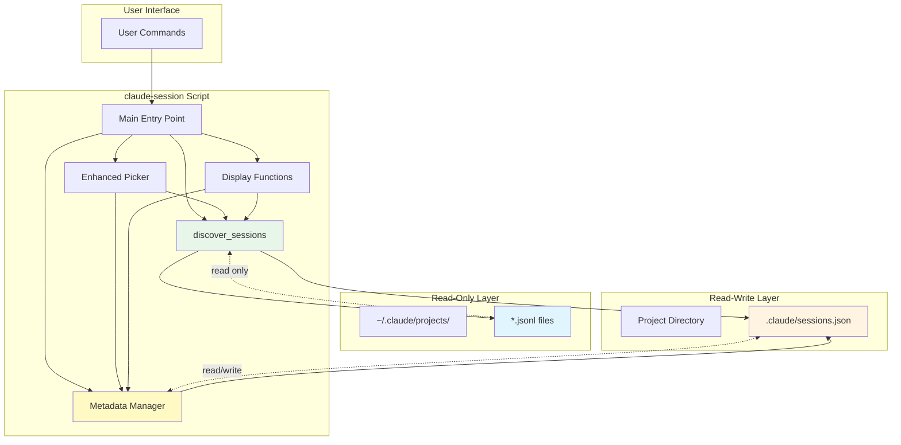

## Directory Structure

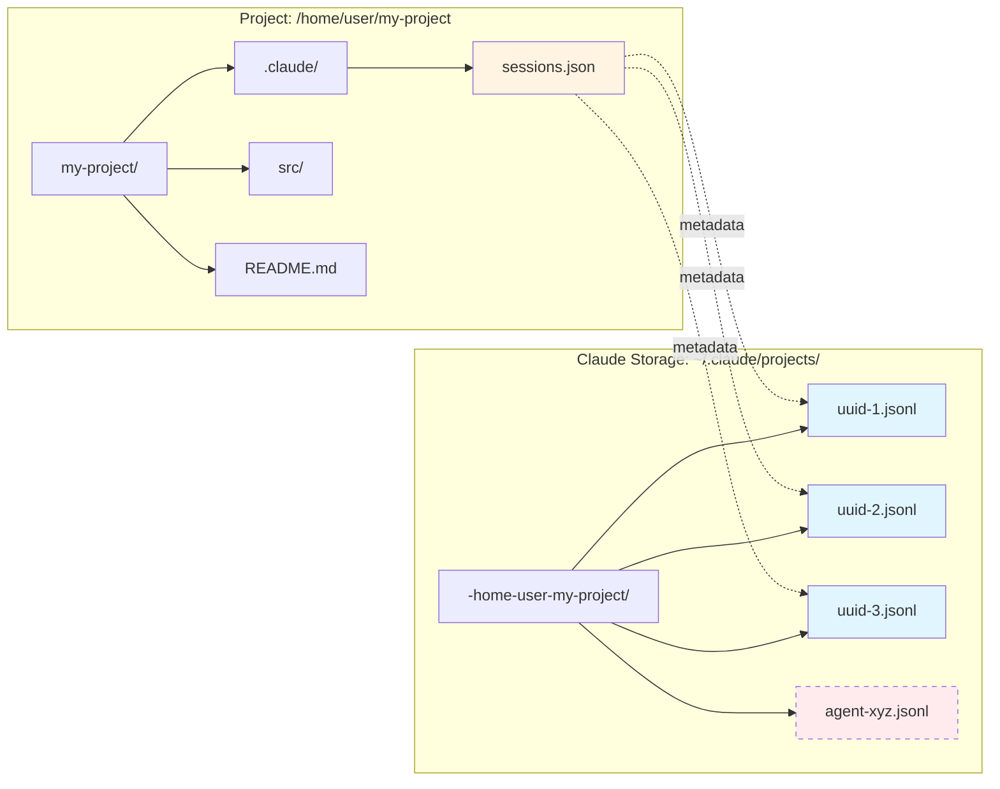

## Path Encoding Flow

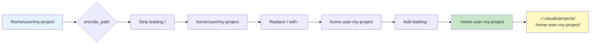

## Session Discovery Process

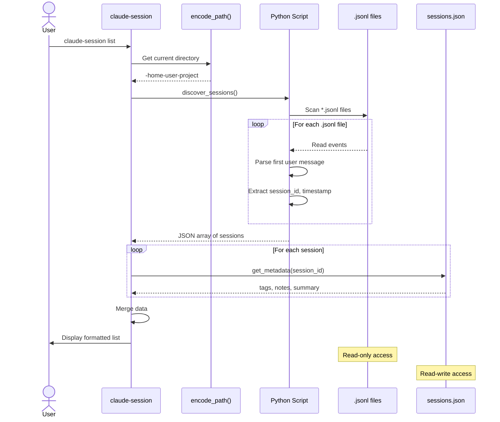

## Session File (.jsonl) Structure

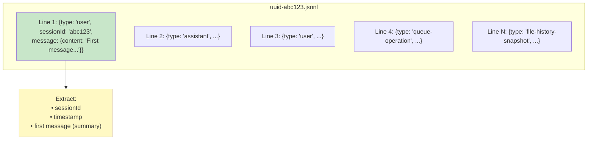

## Metadata Management Flow

```mermaid
flowchart TD
    START[User: claude-session tag abc123 bug urgent]

    PARSE[Parse Arguments]
    PARSE_OUT["session_id = 'abc123'<br/>tags = ['bug', 'urgent']"]

    CHECK{sessions.json<br/>exists?}

    CREATE[Create sessions.json<br/>with empty object]

    READ[Read current metadata]

    CURRENT["Current data:<br/>{<br/>  'abc123': {<br/>    tags: ['frontend']<br/>  }<br/>}"]

    APPEND[Use jq to append tags]

    JQ["jq '.abc123.tags += [\"bug\", \"urgent\"]'<br/>jq '.abc123.last_updated = now'"]

    WRITE[Write updated JSON]

    FINAL["Final data:<br/>{<br/>  'abc123': {<br/>    tags: ['frontend', 'bug', 'urgent'],<br/>    last_updated: '2025-11-13T18:00:00Z'<br/>  }<br/>}"]

    CONFIRM[✓ Added tags to session abc123]

    START --> PARSE
    PARSE --> PARSE_OUT
    PARSE_OUT --> CHECK
    CHECK -->|No| CREATE
    CHECK -->|Yes| READ
    CREATE --> READ
    READ --> CURRENT
    CURRENT --> APPEND
    APPEND --> JQ
    JQ --> WRITE
    WRITE --> FINAL
    FINAL --> CONFIRM

    style START fill:#e3f2fd
    style PARSE_OUT fill:#fff9c4
    style CURRENT fill:#ffe0b2
    style JQ fill:#c8e6c9
    style FINAL fill:#dcedc8
    style CONFIRM fill:#c5e1a5
```

## Enhanced fzf Picker Flow

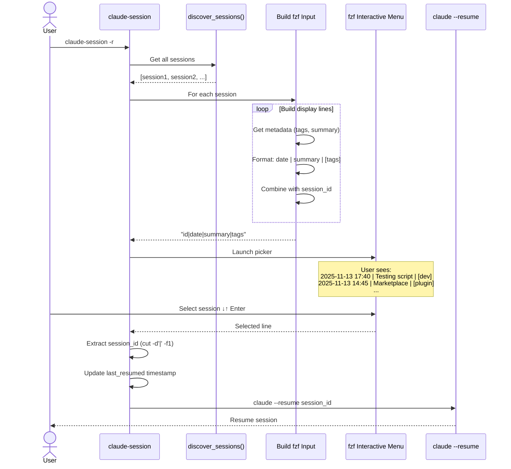

## Command Flow Comparison

```mermaid
graph TB
    subgraph "claude-session list"
        L1[Encode path] --> L2[Discover sessions]
        L2 --> L3[Get metadata]
        L3 --> L4[Format output]
        L4 --> L5[Display colored list]
    end

    subgraph "claude-session stats"
        S1[Discover sessions] --> S2[Count total]
        S2 --> S3[Count with metadata]
        S3 --> S4[Extract all tags]
        S4 --> S5[Count tag occurrences]
        S5 --> S6[Find most recent]
        S6 --> S7[Display report]
    end

    subgraph "claude-session tag"
        T1[Parse arguments] --> T2[Validate session ID]
        T2 --> T3[Init sessions.json]
        T3 --> T4[Append tags with jq]
        T4 --> T5[Update timestamp]
        T5 --> T6[Confirm success]
    end

    style L1 fill:#e3f2fd
    style S1 fill:#f3e5f5
    style T1 fill:#fff3e0
```

## Data Layer Architecture

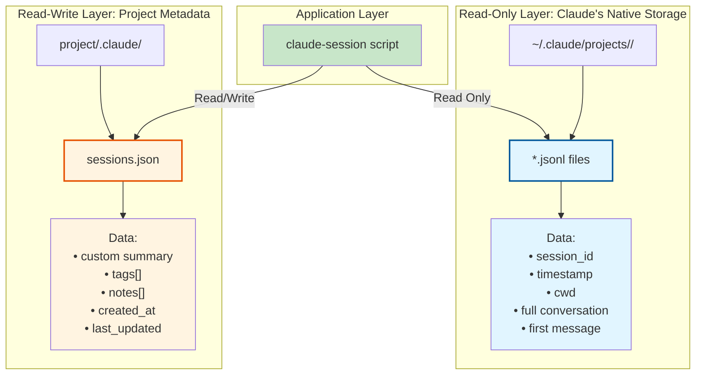

## Python Heredoc Pattern

```mermaid
flowchart LR
    subgraph "Bash Function"
        A[discover_sessions]
        B["sessions_dir=$(...encode_path...)"]
        C["python3 - '$sessions_dir' << 'EOF'"]
    end

    subgraph "Python Script (Embedded)"
        D["import json, glob, sys"]
        E["sessions_dir = sys.argv[1]"]
        F["for jsonl in glob(...):<br/>  parse_file()<br/>  extract_metadata()"]
        G["print(json.dumps(sessions))"]
    end

    subgraph "Back to Bash"
        H["sessions=$(discover_sessions)"]
        I["echo $sessions | jq ..."]
    end

    A --> B
    B --> C
    C -.stdin.-> D
    D --> E
    E --> F
    F --> G
    G -.stdout.-> H
    H --> I

    style C fill:#fff9c4
    style E fill:#c8e6c9
    style G fill:#c8e6c9
    style H fill:#fff9c4
```

## Complete Workflow: Resume Session

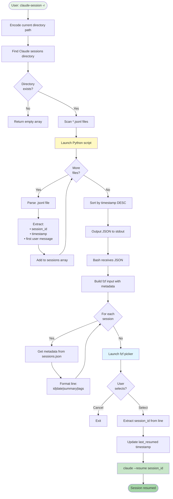

## Metadata Schema

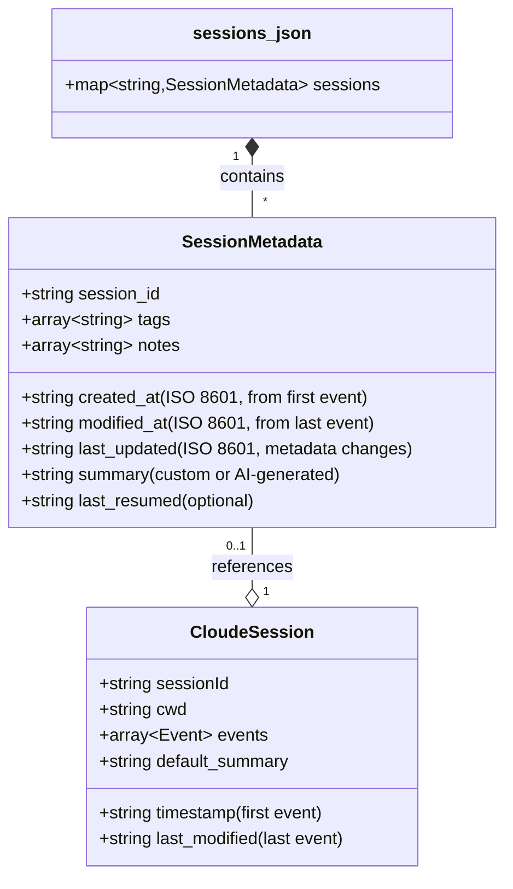

**Key Fields:**
- `created_at`: From first event timestamp in .jsonl (never changes)
- `modified_at`: From last event timestamp in .jsonl (session activity)
- `last_updated`: When metadata was last manually updated (tags, notes, etc)
- `summary`: Custom text or AI-generated summary (via Haiku)

## AI Summary Generation Flow

```mermaid
sequenceDiagram
    participant User
    participant Script as claude-session
    participant Check as is_session_recently_modified()
    participant Haiku as Claude Haiku
    participant JSONL as Session .jsonl
    participant Meta as sessions.json

    User->>Script: summary --generate [ID]

    alt No ID provided
        Script->>Script: get_current_session_id()
        Note over Script: Uses most recent session
    end

    Script->>Check: Check if modified < 5 min ago

    alt Recently modified
        Check-->>Script: true
        Script-->>User: ⚠️ Warning: May be active session
    end

    Script->>Haiku: Resume session with prompt
    Note over Haiku: timeout 30s<br/>Prompt: "Output ONLY a single<br/>short sentence (max 15 words)"

    alt Session locked/timeout
        Haiku--xScript: timeout (124)
        Script-->>User: ERROR: Unable to resume. Try later.
    else Success
        Haiku-->>Script: Generated summary text
        Script->>Script: Filter preamble lines
        Note over Script: Remove "I'll", "Here", etc.
        Script->>Meta: Update summary field
        Script-->>User: ✓ Generated summary: [text]
    end

    style User fill:#e1f5ff
    style Script fill:#fff4e1
    style Haiku fill:#c8e6c9
    style Meta fill:#fff4e1
```

**Key Features:**
- **30-second timeout**: Prevents hanging on active sessions
- **Warning system**: Alerts if session modified in last 5 minutes
- **Preamble filtering**: Removes "I'll create...", "Here's...", etc.
- **Force flag**: `--force` to overwrite existing summaries
- **Content handling**: Gracefully handles list-type message content

## Timestamp Tracking & Auto-Sync

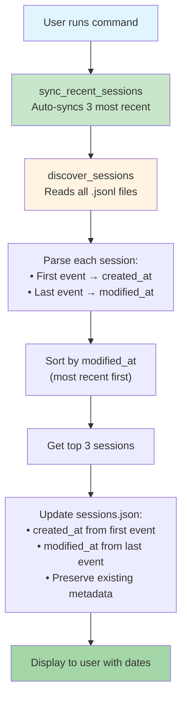

**Auto-Sync Triggers:**
- `get_metadata()` - Before reading any metadata
- `update_metadata()` - Before updating metadata
- `append_metadata()` - Before appending to arrays
- `cmd_list()` - When listing sessions
- `cmd_stats()` - When showing statistics

**Benefits:**
- Always accurate timestamps from session files
- No manual timestamp management needed
- Sessions ordered by last activity (most useful)

## Display Format: Created vs Modified

**List Output:**
```
a3c7d3cb-6f04-47bf-8f82-c8acc9a5cef8
  Created:  2025-11-13 14:45
  Modified: 2025-11-13 19:15
  Summary: Fixed fzf picker and added AI summaries
  Tags: enhancement debugging
```

**Picker Output (Same Day):**
```
2025-11-13 14:45→19:15 | Fixed fzf picker | [enhancement,debugging]
```

**Picker Output (Multi-Day):**
```
C:2025-11-12 10:00 M:2025-11-13 15:00 | Database schema design | [backend]
```

## Tag Statistics Generation

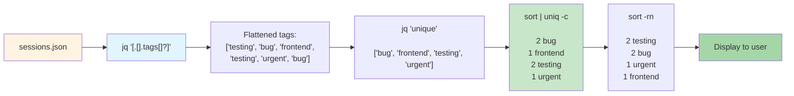

## Key Design Principles

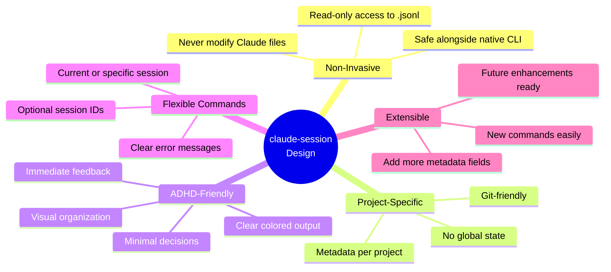

## Complete System Overview

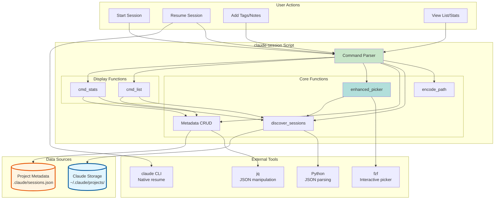

---

## Summary

The `claude-session` script works by:

1. **Discovery**: Scanning Claude's native `.jsonl` files (read-only) to find sessions
2. **Timestamp Tracking**: Extracting created/modified times from first/last events
3. **AI Summaries**: Using Claude Haiku to generate concise session descriptions
4. **Enhancement**: Adding project-specific metadata (tags, notes, summaries) in `.claude/sessions.json`
5. **Display**: Merging both data sources to show rich, organized session information
6. **Integration**: Working alongside Claude's native commands without modification

**New Features:**
- **AI-powered summaries** - Generate concise descriptions with `--generate` flag
- **Accurate timestamps** - Track both created and modified times from session events
- **Smart ordering** - Sessions sorted by last activity (most recent first)
- **Enhanced display** - Show both created/modified dates in list and picker
- **Activity warnings** - Alerts when trying to summarize recently active sessions
- **Robust handling** - Gracefully handles paths with dots and list-type content

All while following ADHD-friendly design principles and your coding preferences!
